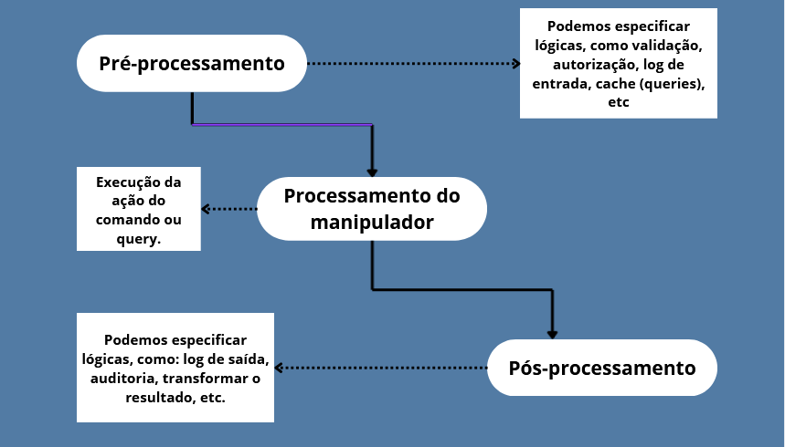

# Validação com Pipeline Behavior do MediatR e Fluent Validation
## Segregando responsabilidades

Este projeto apresenta um exemplo de como utilizar o Pipeline Behavior do MediatR e Fluent Validation para criar validações
isoladas de comandos (commands) e consultas (queries).

# Pré-requisitos
- .NET 9.0;
- Pacotes NuGet:
	- FluentValidation.DependencyInjectionExtensions (12.0.0);
	- MediatR (13.0.0); 

# Camadas

## Lab.Mediator.ValidationExample.Core
Camada para definição de entidades e classes customizadas para exceções.

## Lab.Mediator.ValidationExample.Application
Camada específica para definição de regras de negócios, comandos, validações, etc.

## Lab.Mediator.ValidationExample
Trata-se da API, isto é, ponto de entrada da aplicação.

# Fluxo da aplicação

## Controller
O ponto de entrada ocorre através da controller `UserController`, especificamente no endpoint `Create`. `Create` recebe requisições 
do tipo `POST` e espera os seguintes parâmetros no corpo da requisição:

```
{
	"Name": "string"
	, "Phone": "string"
}
```

## Comando (command) e manipulador (handler)
Após receber uma requisição em `Create` na controller `UserController` ocorre a chamada do handler do comando `CreateUserCommand`.
O handler responsável é o `CreateUserCommandHandler`. Ao ser invocado, inicia-se a execução do `Pipeline Behavior`. Primeiramente
ocorre a execução do pré-processamento, que no contexto deste projeto consiste em validar os atributos de `CreateUserCommand`. 
A validação do comando foi implementada na classe `CreateUserCommandValidator`. A configuração do pipeline da validação pode ser
encontrada na classe `ValidationBehavior`.

### Pipeline Behavior - ValidationBehavior

#### Pré-processamento
O pré-processamento consiste na validação do comando `CreateUserCommand`, onde é verificado se os atributos `Name` e `Phone` foram 
informados. Se os atributos estiverem corretos, o fluxo segue para a execução do manipulador `CreateUserCommandHandler`.

#### Processamento
Após a validação, inicia-se a execução da lógica implementada no manipulador `CreateUserCommandHandler`. No caso, a lógica deste manipulador
está simplificada neste projeto, visto que o intuito é apenas exemplificar o comportamento do `Pipeline Behavior`.

#### Pós-processamento
Após concluir a execução da lógica do manipulador, inicia-se o pós-processamento, onde neste projeto foi adicionado um log
para informar que a execução do manipulador ocorreu com sucesso.

#### Exemplo
Na prática, podemos imaginar e utilizar o `Pipeline Behavior` da seguinte maneira:



### Tratamento global para erros

Foi implementado o método `UseValidationExceptionHandler` (método de extensão de `IApplicationBuilder`), que captura todas as exceções lançadas pela aplicação.
Dessa forma, é possível tratar tanto erros de validação quanto erros inesperados, garantindo que seja retornado ao solicitante o status code adequado e uma mensagem mais clara sobre o erro.